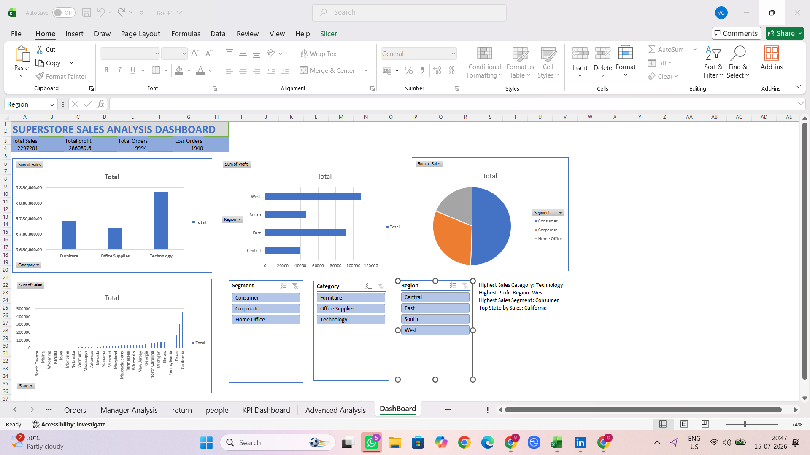

# 📊 Superstore Sales Dashboard using Microsoft Excel

## 📌 Project Overview
This project analyzes Superstore sales data using Microsoft Excel. The dashboard provides interactive insights into sales, profit, orders, and regional performance.

## 🛠️ Tools Used
- Microsoft Excel
- Pivot Tables
- Pivot Charts
- Slicers
- Conditional Formatting
- KPI Cards

## 📈 Dashboard Features
- Total Sales KPI
- Total Profit KPI
- Total Orders KPI
- Loss Orders KPI
- Sales by Category
- Profit by Region
- Sales by Segment
- State-wise Analysis
- Interactive Slicers

## 🖼️ Dashboard Preview

## 📂 Files Included
- superstore-sales-dashboard.xlsx
- dashboard.png
- README.md

## 🎯 Skills Demonstrated
- Data Cleaning
- Data Analysis
- Dashboard Design
- Data Visualization
- Business Reporting
